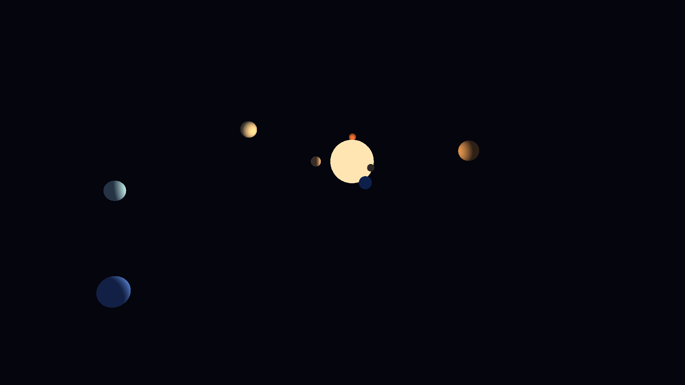

# OpenGL Solar System

[](https://opensource.org/licenses/MIT)
[](https://isocpp.org/)
[](https://www.opengl.org/)

A fully interactive 3D solar system simulation built with **C++** and **OpenGL 3.3**, featuring Newtonian gravity, a free‑flight camera, real‑time rendering, and dynamic time scaling.



## ✨ Features

- **Realistic gravity simulation** – N‑body gravitational forces between planets (and the Sun) calculated every frame.
- **Free 3D camera** – Move anywhere in the scene using WASD + mouse + scroll.
- **Time control** – Pause the simulation, speed up or slow down ( `+` / `-` ).
- **Fullscreen toggle** – Switch between windowed and fullscreen mode (`F11`).
- **Central light source** – The Sun emits light; planets are illuminated with ambient + diffuse (Lambertian) lighting.
- **Smooth movement** – Frame‑independent camera motion using `deltaTime` and substeps for stable physics.

## 🎮 Controls

| Key / Action           | Effect                               |
|------------------------|--------------------------------------|
| `W` `A` `S` `D`        | Move camera horizontally             |
| `SPACE`                | Move camera **up**                   |
| `LEFT CTRL`            | Move camera **down**                 |
| `Mouse`                | Look around (yaw + pitch)            |
| `Scroll wheel`         | Move forward / backward quickly      |
| `P`                    | Pause / resume simulation            |
| `+` / `-`              | Increase / decrease simulation speed |
| `R`                    | Reset camera to default position     |
| `F11`                  | Toggle fullscreen mode               |
| `ESC`                  | Exit the application                 |

## 🛠️ Build Instructions

### Prerequisites

Make sure you have the following installed:

- **CMake** (version 3.10 or higher)
- A **C++17** compatible compiler (GCC, Clang, MSVC)
- **OpenGL 3.3** (or higher – driver support)
- **GLFW**, **GLAD**, **GLM** (these are fetched automatically – see below)

### Build steps

```bash
# Clone the repository
git clone https://github.com/IanosAlex-Marian/SolarSystem.git
cd SolarSystem

# Switch to the "Atestat" branch (or main branch if merged)
git checkout Atestat

# Create a build directory
mkdir build && cd build

# Configure with CMake
cmake ..

# Build the project
cmake --build . --config Release

# Run the executable
# On Linux/macOS:
./SolarSystem
# On Windows:
./Release/SolarSystem.exe